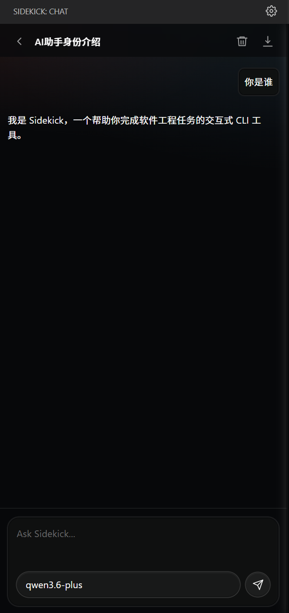

# Sidekick

Sidekick 是一个面向 VS Code 的 AI 编程助手，围绕真实编码流程提供三类核心能力：侧边栏多会话聊天、编辑器内联补全、基于选区的 AI 操作。

它不绑定单一模型平台，Provider、模型、Agent 工具和 MCP Server 都由你自己配置，更适合希望掌控模型接入方式的个人开发者和团队。

## 截图



## 特性

- 多会话聊天：支持创建、切换、删除会话，聊天记录持久化保存
- 会话级模型选择：每个会话独立选择 Provider 和模型
- 上下文感知：自动收集当前选区、代码位置、部分搜索结果和 Git 信息
- 选区快捷操作：一键发起 `Explain Code`、`Refactor`、`Fix Bugs`、`Add Tests`、`Document`
- 内联补全：支持流式补全、缓存、防抖和局部接受
- Agent 工具调用：支持读写文件、搜索项目、执行终端命令、应用补丁等
- MCP 接入：可把已启用的 MCP 工具自动并入 Agent 工作流
- Git 提交信息生成：根据当前 diff 和最近提交记录生成 commit message
- 调试与可观察性：支持查看原始消息、工具调用过程、导出聊天记录、打开内联日志

## 适合谁用

- 想在 VS Code 中统一聊天、补全和代码操作入口的人
- 想自行接入 OpenAI、Anthropic 或兼容接口模型的人
- 需要 Agent 工具调用和 MCP 扩展能力的人
- 希望基于真实工作区和 Git 上下文进行协作编码的人

## 快速开始

1. 安装扩展。
2. 执行 `Sidekick: Open Settings`。
3. 添加至少一个 Provider 和模型。
4. 设置 `sidekick.chatProfile`、`sidekick.completionProfile`、`sidekick.agentProfile`。
5. 如需 MCP 工具，配置 `sidekick.mcpServers`。
6. 从活动栏打开 Sidekick 面板开始聊天。

## 支持的 Provider 类型

- `openai-chat`
- `openai-responses`
- `openai-compatible`
- `anthropic-messages`

单个 Provider 下还可以通过 `models[].endpointType` 为不同模型指定接口类型，例如：

- `OPENAI`
- `OPENAI_RESPONSE`
- `OPENAI_COMPATIBLE`
- `OPENAI_COMPATIBLE_RESPONSE`
- `OPENAI_COMPATIBLE_RESPONSES`
- `ANTHROPIC_MESSAGES`

## 配置项

- `sidekick.providers`：Provider 列表
- `sidekick.chatProfile`：聊天默认模型配置
- `sidekick.completionProfile`：内联补全模型配置
- `sidekick.agentProfile`：Agent / 工具调用模型配置
- `sidekick.mcpServers`：MCP Server 列表
- `sidekick.commitMessageLanguage`：提交信息语言，支持 `auto`、`zh-CN`、`en`

## 配置示例

```json
{
  "sidekick.providers": [
    {
      "id": "openai",
      "label": "OpenAI",
      "apiType": "openai-chat",
      "baseUrl": "https://api.openai.com/v1",
      "apiKey": "YOUR_API_KEY",
      "defaultModel": "gpt-4.1",
      "enabled": true,
      "models": [
        {
          "id": "gpt-4.1",
          "name": "gpt-4.1",
          "endpointType": "OPENAI"
        }
      ]
    }
  ],
  "sidekick.chatProfile": {
    "providerId": "openai",
    "model": "gpt-4.1",
    "temperature": 0.3,
    "maxTokens": 4096
  },
  "sidekick.completionProfile": {
    "providerId": "openai",
    "model": "gpt-4.1",
    "temperature": 0.2,
    "maxTokens": 512
  },
  "sidekick.agentProfile": {
    "providerId": "openai",
    "model": "gpt-4.1",
    "temperature": 0.2,
    "maxTokens": 4096
  },
  "sidekick.commitMessageLanguage": "auto",
  "sidekick.mcpServers": [
    {
      "name": "filesystem",
      "command": "npx",
      "args": [
        "-y",
        "@modelcontextprotocol/server-filesystem",
        "."
      ],
      "enabled": true
    }
  ]
}
```

## 常用命令

- `Sidekick: Open Chat`
- `Sidekick: Open Settings`
- `Sidekick: Explain Code`
- `Sidekick: Refactor`
- `Sidekick: Fix Bugs`
- `Sidekick: Add Tests`
- `Sidekick: Document`
- `Sidekick: Generate Commit Message`
- `Sidekick: Test Provider Connection`
- `Sidekick: Open Inline Logs`
- `Sidekick: Inline Debug Ping`

## 开发

1. `npm install`
2. `npm run compile`
3. 在 VS Code 中启动 Extension Development Host

可用脚本：

- `npm run compile`
- `npm run watch`
- `npm run test:gateway`
